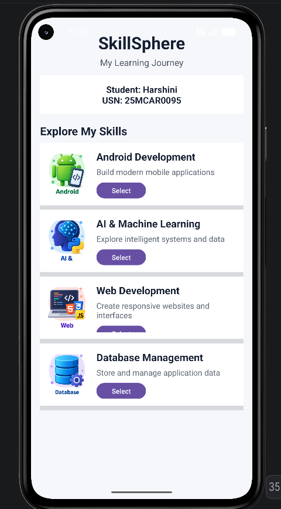
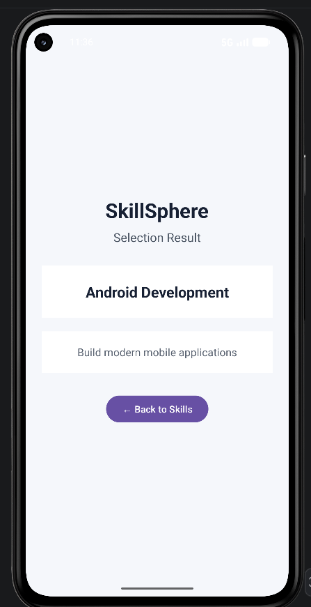

# Exp7 – Adaptive Android Application using ListView and ImageView

## Student Details

**Name:** Harshini  
**USN:** 25MCAR0095  
**Project:** Exp7  
**Platform:** Android Studio  
**Language:** Kotlin  

---

## 1. Experiment Title

**Creating an Adaptive Android Application with ListView and ImageView**

---

## 2. Aim

To develop an adaptive Android application using Kotlin and XML that demonstrates the use of **ListView, ImageView, custom list items, and event handling**.

The application displays different learning skills with corresponding images and descriptions. The user can select a skill and view the selected skill and its message on a separate page.

---

## 3. Concept / Technology Used

The following Android concepts and technologies are used in this experiment:

- **Android Studio** – Integrated Development Environment used to develop the application.
- **Kotlin** – Programming language used for application development.
- **XML** – Used to design the application user interface.
- **ListView** – Used to display multiple skill items in a vertical list.
- **ImageView** – Used to display images associated with each skill.
- **BaseAdapter** – Used to connect the skill data with the ListView.
- **Intent** – Used to transfer selected skill information between activities.
- **Button Event Handling** – Used to select a skill and navigate to the result page.

---

## 4. Scenario Used

The application is designed as a personal learning application called **"SkillSphere – My Learning Journey"**.

The application displays the student's name and USN and provides a list of different technical skills:

1. Android Development
2. AI & Machine Learning
3. Web Development
4. Database Management

Each skill contains:

- Skill image
- Skill name
- Skill description
- Select button

When the user clicks the **Select** button, the application opens a second page and displays the selected skill along with its corresponding message.

---

## 5. Main Features

- Displays the application title **SkillSphere**.
- Displays student name and USN.
- Uses **ListView** to display multiple skills.
- Uses **ImageView** for skill-related images.
- Uses a custom **BaseAdapter**.
- Displays skill name and description dynamically.
- Provides a **Select** button for each skill.
- Opens a second page using **Intent**.
- Displays the selected skill and message on the result page.
- Provides a **Back to Skills** button.

---

## 6. Project Folder and File Structure

```text
Exp7/
│
├── app/
│   └── src/
│       └── main/
│           │
│           ├── java/
│           │   └── com/
│           │       └── example/
│           │           └── exp7/
│           │               ├── MainActivity.kt
│           │               ├── ResultActivity.kt
│           │               ├── Skill.kt
│           │               └── SkillAdapter.kt
│           │
│           ├── res/
│           │   │
│           │   ├── drawable/
│           │   │   ├── android.png
│           │   │   ├── ai.png
│           │   │   ├── web.png
│           │   │   └── database.png
│           │   │
│           │   └── layout/
│           │       ├── activity_main.xml
│           │       ├── activity_result.xml
│           │       └── list_item.xml
│           │
│           └── AndroidManifest.xml
│
├── Screenshots/
│   ├── Output1.png
│   └── Output2.png
│
├── build.gradle.kts
├── settings.gradle.kts
├── gradle.properties
├── gradlew
├── gradlew.bat
└── README.md
```

---

## 7. Description of Important Files

| File | Description |
|---|---|
| `MainActivity.kt` | Creates the list of skills and connects it to the ListView. |
| `ResultActivity.kt` | Displays the selected skill and its corresponding message. |
| `Skill.kt` | Data class containing skill name, description and image resource. |
| `SkillAdapter.kt` | Custom BaseAdapter used to populate each ListView row. |
| `activity_main.xml` | Defines the main SkillSphere interface. |
| `list_item.xml` | Defines each skill item with ImageView, TextViews and Select button. |
| `activity_result.xml` | Defines the second/result page. |
| `AndroidManifest.xml` | Registers the application activities. |
| `drawable/` | Contains the images used in the application. |
| `Screenshots/` | Contains the output and test-case screenshots. |

---

## 8. Procedure

### Step 1

Create a new Android Studio project named **Exp7** using Kotlin.

### Step 2

Configure the Android SDK and emulator required to run the application.

### Step 3

Create the `Skill.kt` data class containing:

- Skill name
- Skill description
- Image resource

### Step 4

Add the required skill images to the `drawable` resource folder.

### Step 5

Design the main interface using `activity_main.xml`.

The main page contains:

- Application title
- Subtitle
- Student name
- USN
- ListView

### Step 6

Create `list_item.xml` to define the appearance of each skill item.

Each item contains:

- ImageView
- Skill name
- Skill description
- Select button

### Step 7

Create `SkillAdapter.kt` by extending `BaseAdapter`.

The adapter dynamically loads the skill name, description and image into each ListView item.

### Step 8

Create `ResultActivity.kt` and `activity_result.xml`.

The second page displays the selected skill and its corresponding message.

### Step 9

Use an Android `Intent` to transfer the selected skill information from the first page to `ResultActivity`.

### Step 10

Build and run the application on an Android emulator.

### Step 11

Perform the defined test cases.

### Step 12

Capture screenshots of the application output and save them inside the `Screenshots` folder.

### Step 13

Upload the complete Android Studio project and README file to GitHub.

---

## 9. Application Workflow

```text
                         START
                           |
                           ↓
              ┌────────────────────────┐
              │      SkillSphere        │
              │  My Learning Journey    │
              └───────────┬────────────┘
                          |
                          ↓
              ┌────────────────────────┐
              │       Skill List       │
              ├────────────────────────┤
              │ Android Development    │
              │ AI & Machine Learning  │
              │ Web Development        │
              │ Database Management    │
              └───────────┬────────────┘
                          |
                          ↓
                    Click Select
                          |
                          ↓
              ┌────────────────────────┐
              │      Result Page       │
              │                        │
              │    Selected Skill      │
              │          +             │
              │       Message          │
              └───────────┬────────────┘
                          |
                          ↓
                    Back Button
                          |
                          ↓
                      Skill List
```

---

## 10. Expected Output

### Page 1 – Skill List

The first page displays the application title, student details, and the list of skills.

```text
SkillSphere
My Learning Journey

Student: Harshini
USN: 25MCAR0095

Explore My Skills

Android Development
Build modern mobile applications
[ Select ]

AI & Machine Learning
Explore intelligent systems and data
[ Select ]

Web Development
Create responsive websites and interfaces
[ Select ]

Database Management
Store and manage application data
[ Select ]
```

### Page 2 – Selection Result

When the user selects a skill, the second page displays the selected skill and its corresponding message.

Example:

```text
SkillSphere
Selection Result

AI & Machine Learning

Explore intelligent systems and data

[ ← Back to Skills ]
```

---

# 11. Test Cases

## Test Case 1 – Verify Student Details

| Test Case ID | TC01 |
|---|---|
| Test Case | Verify student name and USN |
| Input | Launch the application |
| Expected Result | Student name **Harshini** and USN **25MCAR0095** should be displayed |
| Actual Result | Student name and USN are displayed successfully |
| Status | PASS |
| Screenshot | `Output1.png` |

---

## Test Case 2 – Verify ListView and ImageView

| Test Case ID | TC02 |
|---|---|
| Test Case | Verify skill list and images |
| Input | Open the SkillSphere application |
| Expected Result | Four skills should be displayed with their corresponding images and descriptions |
| Actual Result | Android Development, AI & Machine Learning, Web Development and Database Management are displayed |
| Status | PASS |
| Screenshot | `Output1.png` |

---

## Test Case 3 – Verify Skill Selection and Result Page

| Test Case ID | TC03 |
|---|---|
| Test Case | Verify skill selection |
| Input | Click the **Select** button for AI & Machine Learning |
| Expected Result | Result page should open and display the selected skill and its corresponding message |
| Actual Result | Result page displays AI & Machine Learning and its corresponding message |
| Status | PASS |
| Screenshot | `Output2.png` |

---

# 12. Output Screenshots

## Output 1 – Main Skill List



The first screenshot demonstrates the main SkillSphere page containing:

- Student name
- USN
- ListView
- Skill names
- Skill descriptions
- Skill images
- Select buttons

---

## Output 2 – Selection Result



The second screenshot demonstrates the result page after selecting a skill. The selected skill and its corresponding message are displayed.

---


### Output Screenshots

**Output 1:**  
https://github.com/harshinimk13/Exp7/blob/main/Screenshots/Output1.png

**Output 2:**  
https://github.com/harshinimk13/Exp7/blob/main/Screenshots/Output2.png

---

# 13. Result

The adaptive Android application **SkillSphere** was successfully developed using **Kotlin and XML**.

The application demonstrates the use of:

- ListView
- ImageView
- Custom BaseAdapter
- XML layouts
- Android Activities
- Intent communication
- Button event handling

The application successfully displays the student's details and technical skills with corresponding images. Selecting a skill navigates to a second page where the selected skill and its corresponding message are displayed.

All three defined test cases were successfully performed, and the corresponding screenshots were included in the GitHub repository.

---

# 14. Conclusion

The experiment successfully demonstrates how **ListView and ImageView** can be combined with a custom adapter to create an adaptive Android application.

The application also demonstrates activity navigation and data transfer using **Intent**, providing an interactive two-page user experience.

---
## Student Information

**Name:** Harshini  
**USN:** 25MCAR0095  
**Project:** Exp7
